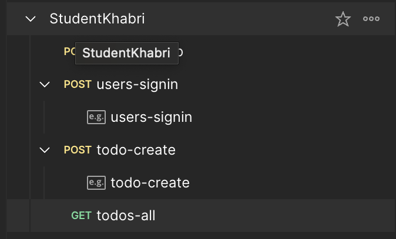
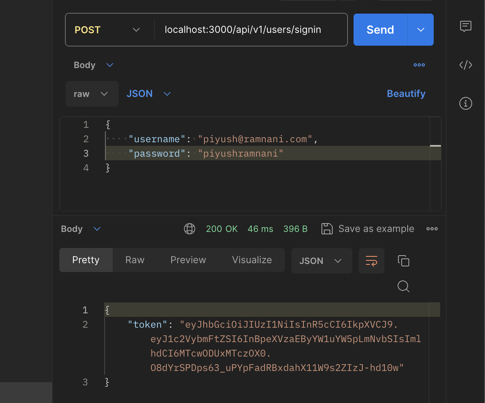
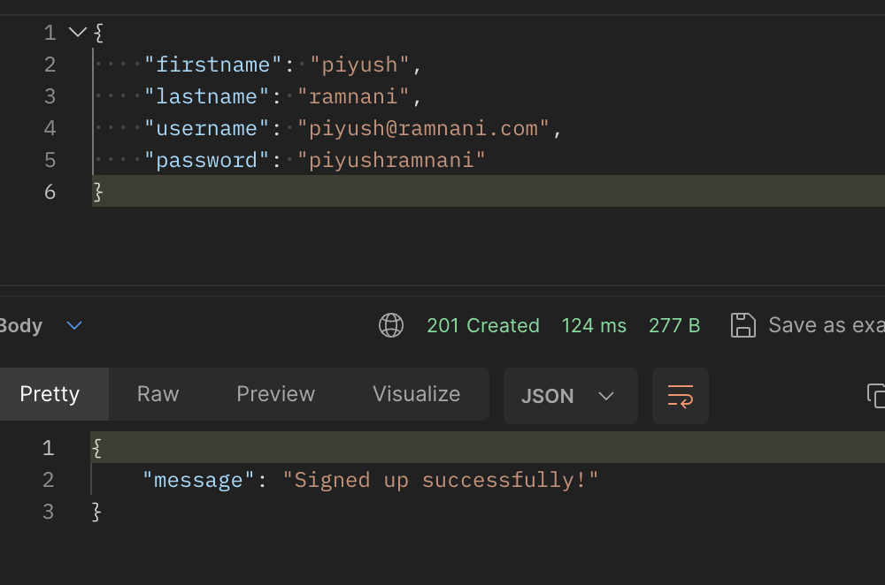
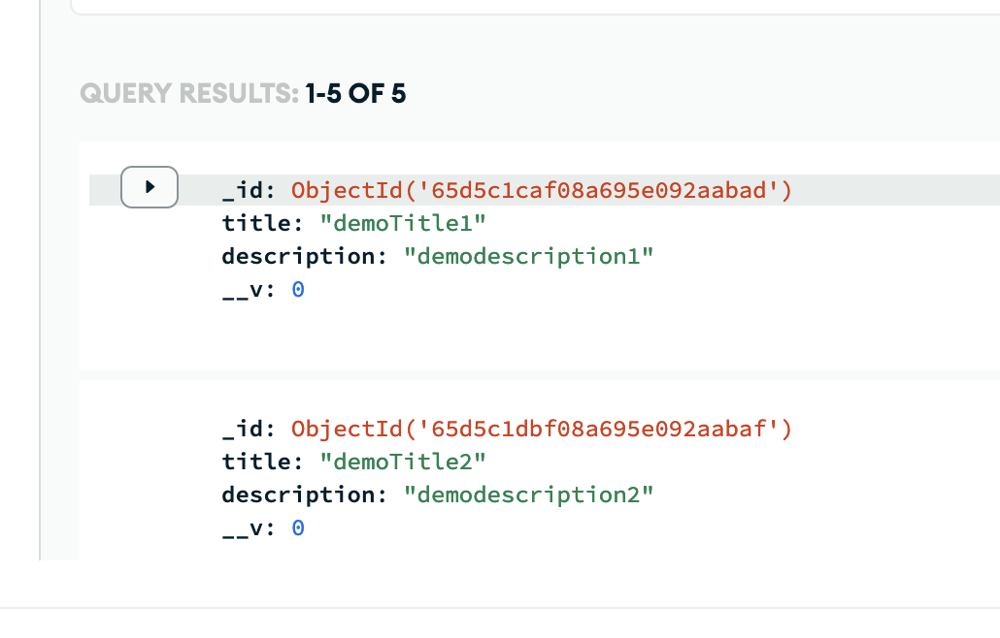
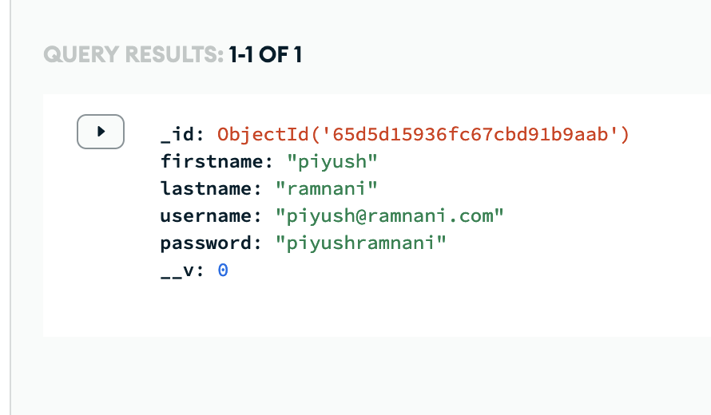

# APIs in NODEJS

This project was given as an in-office task of StudentKhabri. It contains the following APIs which are tested in `POSTMAN`. And `MongoDB` was used as Databse. It contains the following routes:

### POST > http://localhost:3000/api/v1/users/signup

`{firstname, lastname, username, password}` => `{message: user signed up successfully}`

### POST > http://localhost:3000/api/v1/users/signin

`{username, password}` => `{token}`

### POST > http://localhost:3000/api/v1/todo/create

`Authorization: Bearer token | {title, description}` => `{message: todo created}`

### GET > http://localhost:3000/api/v1/users/all-todos

`Authorization: Bearer token` =>

## POSTMAN

## AUTHORIZATION

`jsonwebtoken` is being used for authorization. for `/todo` routes, user is required to put in Authorization token in the headers.

## MONGODB

The database used is `MongoDB`. The schema for the users collection is as follows:

`TODOSCHEMA`
title: String,
description: String,

`USERSCHEMA`
userId: String,
firstname: { type: String },
lastname: String,
username: { type: String, required: true, unique: true, lowercase: true },
password: { type: String, required: true },

---

---
